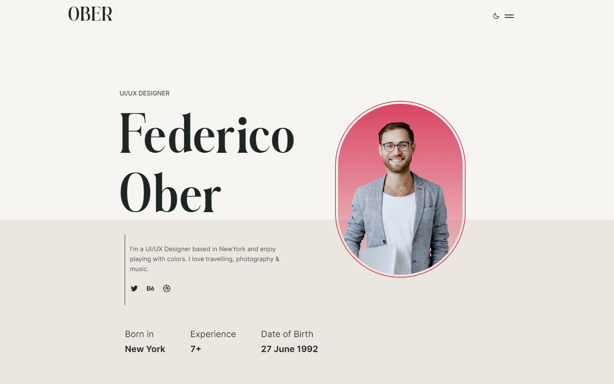
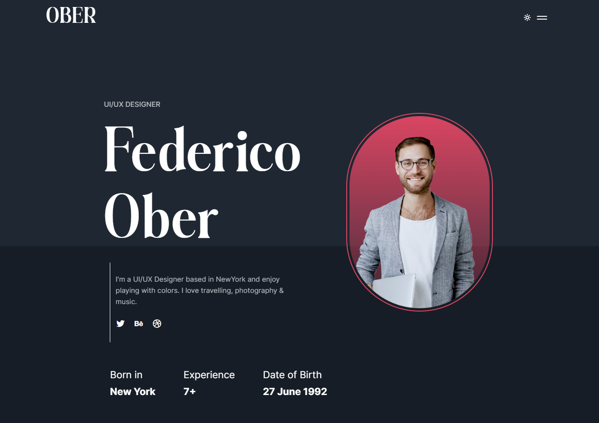

# Ober Portfolio Clone

# Light Mode



# Dark Mode



# Used Library

- `mixitup`
- `scrollreveal`
- `swiper`
- `vite`
- `vite-plugin-html`

# Clone the repository to local

```sh
# git clone the repository 🦑
git clone https://github.com/sadman-shami/ober-portfolio-clone.git
cd ober-portfolio-clone

# install dependencies 🧶

# yarn
yarn

# pnpm
pnpm i
```

# Checklist

When you use this template, update the following:

- [ ] Delete `.git` directory
- [ ] Clear `README.md` file
- [ ] Delete `preview.png` file

**Have fun now ✌️**

# Usages

### Yarn

- `yarn dev` - starts vite dev server 🚀
- `yarn build` - build the project -> (minify all {css, js, html} files) 📦
- `yarn preview` - preview the build 🎉

### Pnpm

- `pnpm run dev` - starts vite dev server 🚀
- `pnpm run build` - build the project -> (minify all {css, js, html} files) 📦
- `pnpm run preview` - preview the build 🎉

# Acknowledge

If you found it useful somehow, I would be grateful if you could leave a star in the project's GitHub repository.
**Thank you 😊.**
